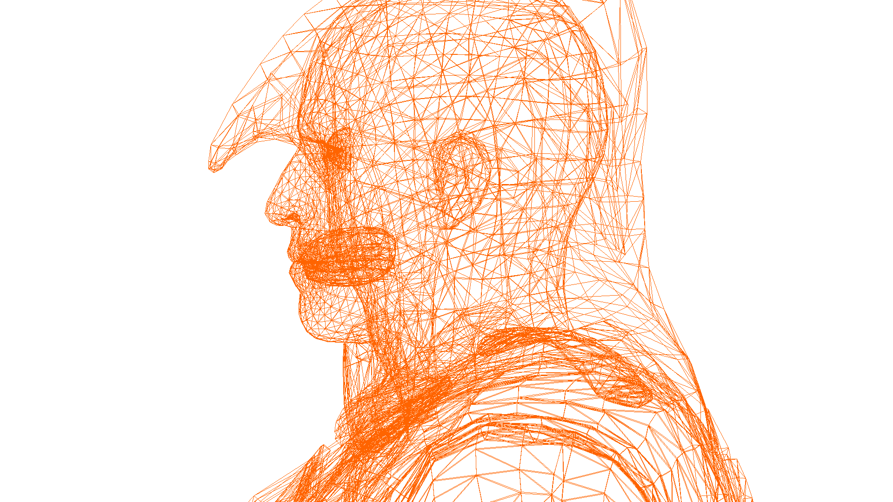
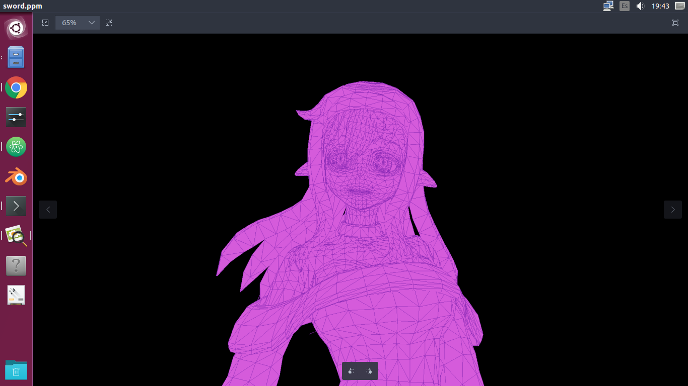
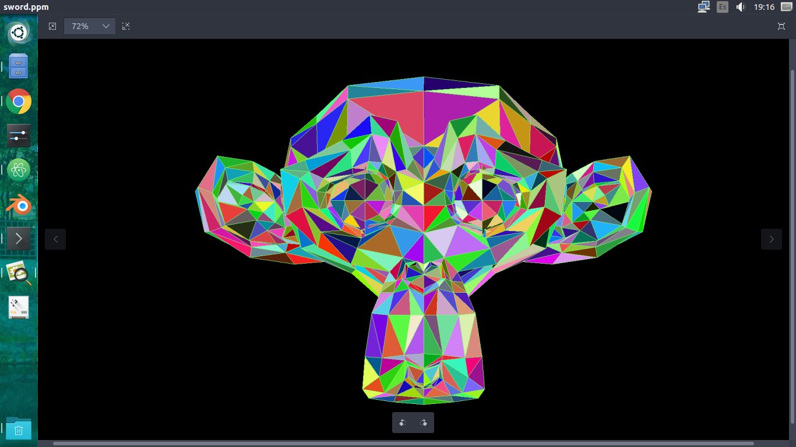
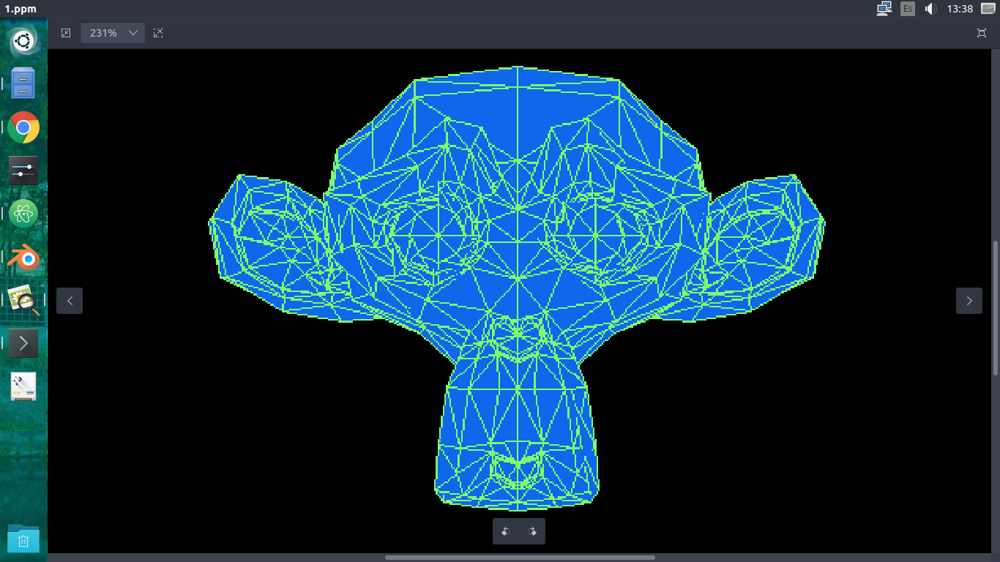

# Computer-Graphics
- Practices of Computer Graphics. 
  - Line Drawing algorithms like naive approach, Bresenham, DDA.
  - Creating an image using the PPM format.
  - 3D to 2D proyection using the homogeneous space and the vertex list format (also edges and faces list).
  - Face hidding and Z-Buffer algorithm.
  - Solid drawing using interpolation.

## Here are some images generated by the program:
- Ratonhnhaké:ton

- Random anime girl

- Suzanne

## Here is a video that I made with a lot of pictures generated with the face hiding + z-buffer program
- Longinus sword 

[Click here or in the image](https://youtu.be/tNhZUlagvjA)
